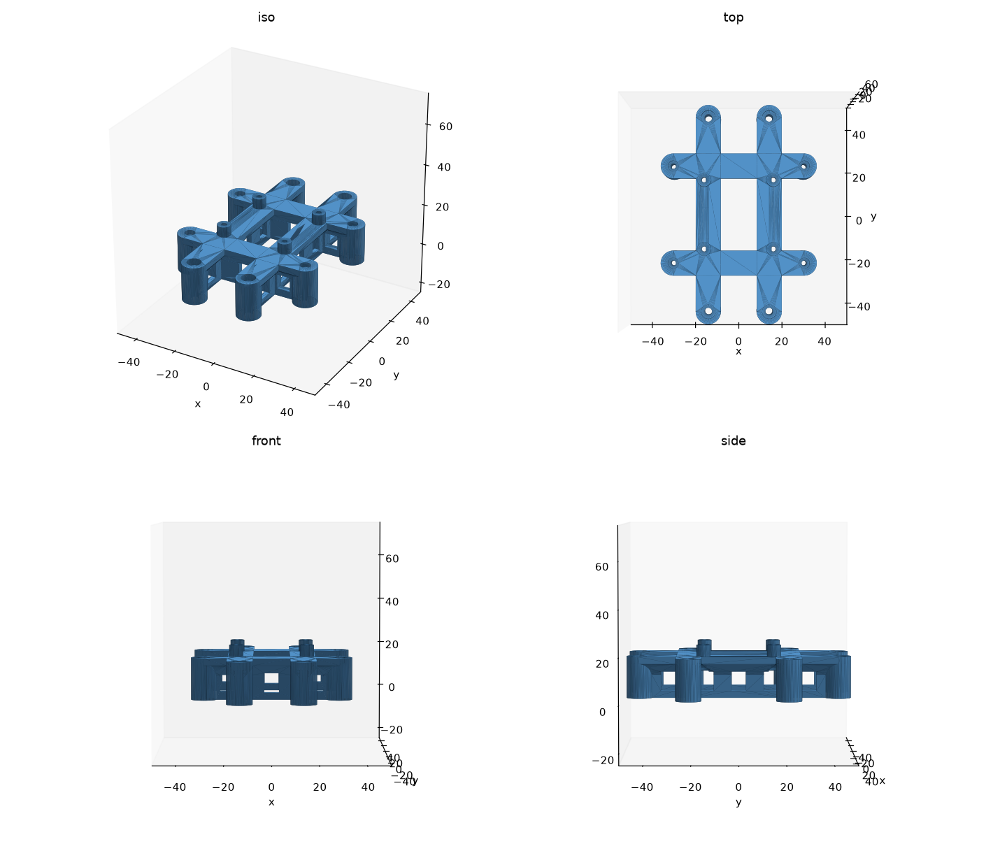

# Printed parts

Upstream sources for printed parts on this aircraft, and the vendor CAD the parts are
dimensioned from. Local copies of what was actually printed go in `stl/`. This repo is
public and MIT-licensed; only commit an upstream STL to `stl/` if its licence permits
redistribution, and record that licence here.

## Parts designed here

### `h743-deck` — flight-controller deck

Carries the Matek H743-WING V3 on a raised deck above the X500 V2 **upper** plate
([DEC-02](../docs/decisions.md)). Source of truth is the parametric model
[`src/h743-deck.py`](src/h743-deck.py) (CadQuery ≥ 2.8); `stl/` holds what it emits.
**Designed 2026-09-17. First one printed 2026-09-18** — red PETG, `petg_riser` profile,
4 h 40 m, 11.29 m of filament, against a slice estimate of 4 h 42 m
([3d-printing print log](https://github.com/WayneKennedy/3d-printing/blob/main/docs/print-log.md)).
**Not yet inspected and not yet offered up to the hardware.** MIT, like the rest of this repo.

| | |
|---|---|
| Footprint | 69 × 97 mm, 23 mm tall; 29.8 cm³, so roughly 35–40 g in PETG |
| Fixes to the plate | 4 × M3 at (±13.5, ±43) — the plate's Ø3.4 holes — plus 4 optional M2 at (±29, ±21.5), the Ø2.2 holes. All eight pads stand on the plate, so the M2 four still work as props if left unbolted |
| Carries the board | 4 bosses on the 30.5 × 30.5 pattern, tops 5.0 mm above the deck. The board is fixed by M2 screws driven **up from under the deck** into its own grommet-wrapped brass standoffs, clamping the PD plate between boss and standoff. The pattern is square, so the board can be turned 90° without changing the part |
| Deck clearance | 15 mm under the flanges, open on all four sides, with windows through every rib for cable runs |
| Bolt access | Every one of the eight heads is outside the 54 × 36 mm board outline, so the board does not have to come off to unbolt the deck |
| Beam ends | Every beam stops on the centre line of the anchor it reaches; the pillar diameter equals the flange width, so the pillar caps the beam tangentially and no corner of a rib or flare stands proud of it |

Hardware, none of it confirmed in stock (the bits boxes are unaudited — [wk-inventory
`docs/stock.md`](https://github.com/WayneKennedy/wk-inventory/blob/main/docs/stock.md)):

- **Plate:** 4 × **M3 × 22 cap head + M3 lock nut** (owner's choice, 2026-09-17). The
  Ø6.4 × 3.2 counterbore takes the 3.0 mm head flush; grip from counterbore floor to under
  the 2 mm plate is 16.8 mm, plus 4.0 mm of nyloc
- **Board:** 4 × **M2 × 14**, longer versions of the PD plate's own screws, driven up from
  below. Grip is 8 mm of deck plus the PD plate, leaving ~4 mm into the standoff — check
  the standoff's depth before buying. The head sits in a Ø5.0 recess under the deck with a
  clear column below it for the driver. The recess is flat-bottomed for a cap or button
  head; set `FC_HEAD_CSK = True` in the source to cut a 90° countersink instead, if you
  buy countersunk
- **Outriggers, optional:** 4 × M2 × 20 + lock nut (counterbore Ø4.8 × 2.2). The plate's
  Ø2.2 holes will not take M3
- Nothing is threaded into plastic and no heat-set inserts are needed

**Fit check first.** `stl/h743-deck-fitcheck.stl` is a 3 mm flat plate — same footprint,
same twelve hole positions, no deck — generated by `src/h743-deck.py --template`. 9.0 cm³,
prints in minutes, and proves the two airframe patterns against the plate and the
30.5 × 30.5 against the board before committing hours to the deck.

Printing: PETG, as modelled — deck up, **no supports**. Every overhang is inside 45°
except the window roofs, which are 4 mm flat bridges. 0.2 mm layers, 4 perimeters, 30%
infill. The ribs are 2.4 mm, so they come out solid.

## Vendor CAD

Both files are free downloads and are **not committed here** (tens of MB each); fetch them
from the URLs below. Everything measured from them is written out in this file, so the
numbers are usable without re-downloading.

| Item | File | URL | Licence |
|---|---|---|---|
| X500 V2 frame, full assembly | `x500v2-frame.step`, 24 MB | [Holybro X500 V2 download page](https://docs.holybro.com/drone-development-kit/px4-development-kit-x500v2/download) | Not stated |
| X500 V2 printable parts | `Holybro_X500_V2_3D Print.zip`, 0.5 MB — landing-gear reinforcement (PLA ×2, TPU), depth-camera mount, XT60 holder | same page | Not stated |
| Holybro 2216 motor | `AIR2216II_Motor_3D.STEP`, 0.8 MB | same page | Not stated |
| Matek H743-WING V3 | `H743-WING-V3_step.zip`, 11 MB — board, top plate, bottom plate | <https://www.mateksys.com/Downloads/other/H743-WING-V3_step.zip> | Not stated |

Matek's H743-WING product page is **gone from mateksys.com** (all `?portfolio=h743-wing*`
slugs return 404, checked 2026-09-17; the board is absent from their [products
list](https://www.mateksys.com/?page_id=2270)). The STEP zip URL above still serves, and
was found on the archived page:
[web.archive.org, 2025 snapshot](https://web.archive.org/web/2025id_/https://www.mateksys.com/?portfolio=h743-wing-v2).
The last manual Matek published for this board is
[`H743-WING_Manual.pdf`](http://www.mateksys.com/downloads/Manual/H743-WING_Manual.pdf)
(Sep 2021, Rev 1.0, headed "H743-WING V2"); the archived page states V1/V2/V3 share one
ArduPilot/INAV target. No V3-specific manual is published.

## Measured geometry

Extracted from the vendor STEP files with OpenCASCADE on 2026-09-17, not from a ruler.
Coordinates are millimetres from each part's own centre. Plate axes are named X and Y
here (the Holybro file has the frame's vertical along its Y axis).

### X500 V2 plates

Both plates are **143.72 × 143.72 × 2.0 mm** — the 144 mm in
[`../docs/bom.md`](../docs/bom.md) is the seller's rounded figure. In the assembly the
lower plate's top face and the upper plate's lower face are **28.0 mm** apart.

**Upper plate — this is the one to mount on, and it has no flight-controller pattern.** Its
holes, all through, axis vertical:

| Ø | Count | Positions (x, y) |
|---|---|---|
| 2.2 | 4 | (±29, ±21.5) — a 58 × 43 mm rectangle, the only small-hardware anchor near the centre |
| 3.4 | 4 | (±13.5, ±43) — 27 × 86 mm |
| 3.4 | 4 | (±13.5, ±68) — 27 × 136 mm, at the plate edges |
| 3.4 | 8 | (±50, ±23), (±50, ±37) |
| 3.4 | 16 | four per corner, at (±58.584, ±55.190), (±55.190, ±58.584), (±53.917, ±50.523), (±50.523, ±53.917) — arm clamps |
| 3.1 | 16 | four per corner, at (±66.574, ±51.018), (±58.089, ±42.532), (±51.018, ±66.574), (±42.532, ±58.089) |
| 10.0 | 4 | (±59, ±10) — cable pass-throughs |
| 12.0 | 8 | (±65.860, ±48.906), (±48.906, ±65.860) — pylon/standoff clearance |

Nothing else is drilled inside |x| < 29, |y| < 21.5, so **any centre mount has to bridge to
the 4 × Ø2.2 holes at (±29, ±21.5) or the 4 × Ø3.4 at (±13.5, ±43)**.

**Lower plate** carries the stock autopilot patterns instead: **30.5 × 30.5 mm** (Ø3 at
(±15.25, ±15.25)) and **45 × 45 mm** (Ø3 at (±22.5, ±22.5)), a Ø6 hole dead centre, Ø16 at
(±42, 0) and (0, ±55.5), Ø10 ×10, Ø5 ×4 at (±50, ±30), Ø3 ×40 in all, Ø2.6 ×8, Ø2.0 ×4.

Which plate edge faces forward is **not determined** — the CAD is symmetric about both
axes and nothing in it marks the nose.

### Matek H743-WING V3

- PCB **54.0 × 36.0 mm**; overall 54 × 36 × 13 mm including Matek's own top and bottom
  protective plates and standoffs (Matek spec). Weight 30 g with the USB extender.
- **Mounting: 30.5 × 30.5 mm**, holes Ø4.0 mm in the PCB, centred on the PCB outline
  (measured). All four holes and their brass standoffs are connected to ground (Matek
  manual).
- **How the stack is actually held** (owner, from the board in hand, 2026-09-17): a brass
  standoff wrapped in a silicone grommet sits in each of those four Ø4 holes, and the
  bottom PD/ESC plate screws up into them with **4 × M2 countersunk**. Those four are the
  PD plate's only holes, all labelled GND. **So every grommet is consumed inside the
  stack — none is spare for mounting the board to an airframe**, which is why this deck
  fixes the board by driving longer M2 screws up into the same standoffs.
- **How the stack is wired — no board-to-board headers** (Matek manual layout page,
  read 2026-09-23; owner confirms it matches the board in hand). The PD/ESC plate joins
  the main PCB by **four short silicone wires soldered pad to pad**, each board carrying
  the same four-pad group on the same edge: **Vbat** (battery voltage up from the plate's
  + pads), **Curr** (the plate's 0.3 mΩ shunt), **G**, **Vx** (servo BEC rail; its
  5/6/7.2 V jumper is on the plate). Ground is carried by the brass standoffs as well. The
  **top plate is the USB-C/DFU/buzzer extender**, joined by a plug-in **JST-SH 6-pin**
  cable: D+, D−, G, 4V5, Boot, Buz−. Heavy wiring therefore lands on the PD plate: battery
  and ESC power solder to its + and − pads. Whether Matek fits the four wires at the
  factory is unrecorded.
- The vendor STEP also shows a Ø4.0 pattern at (±16, ±25), 32 × 50 mm. **There are no such
  holes on the hardware** (owner, 2026-09-17) — it is a CAD artefact; ignore it.
- Underside components stand up to **4.0 mm** proud of the bare PCB; topside up to 4.4 mm
  (the two JST-GH sockets on the +x edge). With the PD plate fitted, that plate's outer
  face is the lowest surface and is what the deck's bosses meet.
